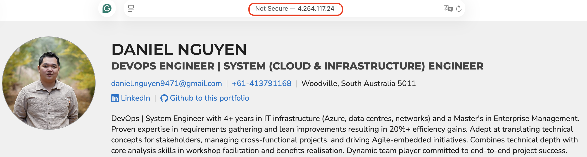

# kube-portfolio
https://kubernetes.io/docs/concepts/configuration/overview/
The setup is based on Kubernetes configuration best practices

**Continue setup portfolio page from https://github.com/danielnguyen0107/tf-azure-aks-porfolio/**


1. Get access credentials for a managed Kubernetes cluster
```
$ az aks get-credentials --resource-group rg-portfolio-rg1 --name portfolio-aks-rg1
```
2. Create a Opaque secret for kubernetes to access storage account as its pv
```
$ STORAGE_KEY=$(az storage account keys list --resource-group rg-portfolio-rg1 --account-name staccrg01 --query "[0].value" -o tsv)
$ kubectl create secret generic azure-secret --from-literal=azurestorageaccountname=staccrg01 --from-literal=azurestorageaccountkey=$STORAGE_KEY
```
3. Deploy the service first

>"Create a Service before its corresponding backend workloads (Deployments or ReplicaSets), and before any workloads that need to access it. When Kubernetes starts a container, it provides environment variables pointing to all the Services which were running when the container was started."
```
$ kubectl apply -f porfolio-services.yaml
```
4. Deploy the pods
```
$ kubectl apply -f porfolio-deployment.yaml
```
5. Check all deployed resources
```
kubectl get all -n portfolio
NAME                            READY   STATUS    RESTARTS   AGE
pod/portfolio-6b4797b5f-2kb9g   1/1     Running   0          4d17h
pod/portfolio-6b4797b5f-mqscs   1/1     Running   0          4d17h

NAME                    TYPE           CLUSTER-IP   EXTERNAL-IP    PORT(S)        AGE
service/portfolio-svc   LoadBalancer   10.0.13.80   4.254.117.24   80:31048/TCP   9d

NAME                        READY   UP-TO-DATE   AVAILABLE   AGE
deployment.apps/portfolio   2/2     2            2           9d

NAME                                  DESIRED   CURRENT   READY   AGE
replicaset.apps/portfolio-6b4797b5f   2         2         2       9d
```

6. From browser, access the EXTERNAL-IP to check if the page is accessible now


7. Set DNS for the page
```
$ IP=4.254.117.24
$ DNSNAME="daniel-aks-portfolio"
$ PUBLICIPID=$(az network public-ip list --query "[?ipAddress!=null]|[?contains(ipAddress, '$IP')].[id]" --output tsv)
$ az network public-ip update --ids $PUBLICIPID --dns-name $DNSNAME
```